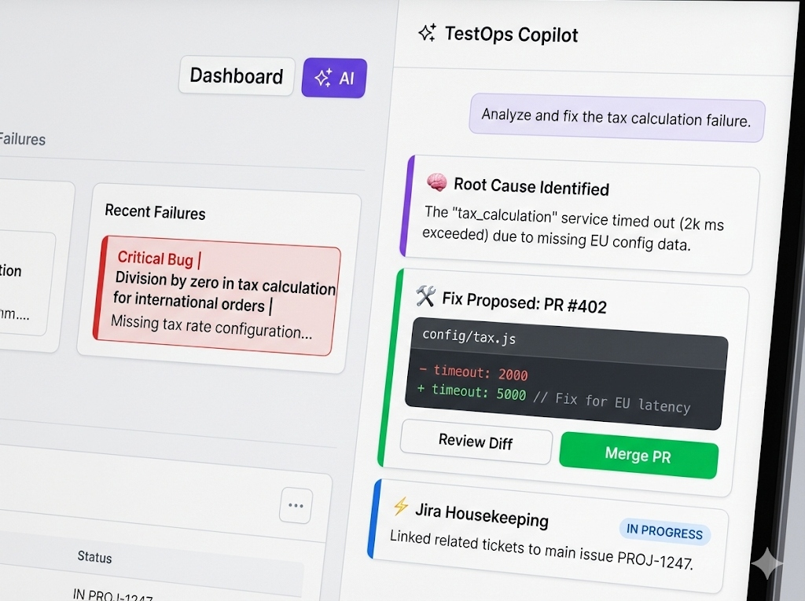

# TestOps Companion

> The AI-powered test operations platform. Manage pipelines, track failures, and let the virtual team of AI specialists handle the detective work.

---

[](https://github.com/rayalon1984/testops-companion/actions/workflows/ci.yml)
[](LICENSE)
[](package.json)
[](CHANGELOG.md)

> **New here?** Start in 5 minutes: **[Quick Start Guide](docs/quickstart.md)** | [MCP Quick Start](docs/MCP_INTEGRATION.md) | [How Does It Work?](docs/HOW_DOES_IT_WORK.md)

### Default Login Credentials

All demo accounts use password `demo123`:

| Email | Role |
|-------|------|
| `admin@testops.ai` | Site Admin |
| `lead@testops.ai` | QA Lead |
| `engineer@testops.ai` | QA Engineer |
| `viewer@testops.ai` | Stakeholder |

Production accounts are defined during setup.

---

## What Is TestOps Companion?

TestOps Companion is a platform that connects to your CI/CD pipelines (Jenkins, GitHub Actions), collects test results, and uses AI to figure out **why** things failed. It builds a knowledge base so the **same failure never wastes your time twice**.

**What makes v3.0 different:** An agentic AI copilot that doesn't just analyze failures — it autonomously searches Jira, queries Confluence, checks pipelines, creates branches, opens PRs, and files issues. All through natural language conversation with a [virtual team of 9 AI specialists](#-virtual-team-persona-routing) and [graduated autonomy](#graduated-autonomy) that lets you control how much the AI does on its own.


*3-column Mission Control: navigation | main content | AI Copilot panel with persona routing*

---

## Table of Contents

- [Features](#features)
- [Virtual Team Persona Routing](#-virtual-team-persona-routing)
- [Tech Stack](#tech-stack)
- [Getting Started](#getting-started)
- [Demo Mode vs Production Mode](#demo-mode-vs-production-mode)
- [Development](#development)
- [Testing](#testing)
- [Integrations](#integrations)
- [API Reference](#api-reference)
- [Project Structure](#project-structure)
- [Documentation](#documentation)
- [Contributing](#contributing)
- [License](#license)

---

## Features

### AI Copilot (Agentic)
- **ReAct Reasoning Loop**: Reason - Act - Observe - Answer cycle with real-time SSE streaming
- **22 AI Tools**: 8 read-only (auto-execute) + 11 write (tiered approval) + 3 housekeeping
- **Virtual Team Routing**: Queries classified to specialist personas (Test Engineer, DevOps, Security, etc.)
- **In-Chat Provider Picker**: Hot-swap between Anthropic, OpenAI, Google, Azure, AWS Bedrock, OpenRouter, or mock
- **Human-in-the-Loop Confirmation**: Write operations (create PR, file Jira issue) require explicit approval with 5-min TTL
- **Auto-Fix Workflow**: Analyzes failure → Creates branch → Commits fix → Opens PR
- **Chat Session Persistence**: Full message history stored and retrievable across sessions
- **Cost Tracking**: Per-session cost breakdown by tool and provider with budget alerts

### Test Intelligence
- **Predictive Failure Analysis**: Trend aggregation, risk scoring per test, z-score anomaly detection
- **Flaky Test Detection**: Statistical scoring identifies intermittently failing tests
- **Test Impact Analysis**: Maps code changes to potentially affected test suites
- **Smart Test Selection**: Recommends which tests to run based on changed files
- **Context Enrichment**: Gathers context from Jira, Confluence, and GitHub simultaneously

### TestOps Platform
- **Multi-Pipeline Dashboard**: Unified view for Jenkins, GitHub Actions, and custom CI
- **3-Column Mission Control**: Real-time dashboard with integrated AI copilot panel
- **Team Workspaces**: Create teams, manage members (OWNER/ADMIN/MEMBER/VIEWER), scope pipelines and dashboards
- **Collaborative RCA**: Comments on failures, version-tracked RCA revisions with optimistic locking
- **Failure Knowledge Base**: Smart fingerprinting, historical trending, category analytics

### Enterprise & Integrations
- **Integrations**: Jira, GitHub, Slack, Confluence, Monday.com, TestRail, Grafana/Prometheus
- **Enterprise Auth**: SSO/SAML 2.0 (Okta, Azure AD), RBAC, audit logging with PII redaction
- **Security**: API key encryption (AES-256-GCM), SSRF protection, Redis token blacklist
- **Observability**: Prometheus metrics (20+), HTTP latency percentiles (p50/p95/p99), OpenTelemetry

> See **[docs/features.md](docs/features.md)** for the complete feature list.

---

## Virtual Team Persona Routing

Every query to the AI copilot is classified and routed to the right specialist before fulfillment:

| Query | Routed To | Why |
|-------|-----------|-----|
| "Why are my tests flaky?" | **Test Engineer** | Flaky test analysis, coverage, CI quality |
| "Pipeline is broken" | **DevOps Engineer** | Pipelines, deployments, CI/CD infrastructure |
| "What can this tool do for me?" | **Product Manager** | Feature discovery, capabilities, onboarding |
| "Is there a security vulnerability?" | **Security Engineer** | Auth, secrets, vulnerabilities |
| "Schema migration failed" | **Data Engineer** | Database, schema, migrations |
| "Page loads too slowly" | **Performance Engineer** | Latency, throughput, profiling |

**How it works:**
1. **Tier 1 — Keyword rules** (zero cost, <1ms): Pattern matching against domain vocabulary
2. **Tier 2 — LLM micro-classification** (fallback, ~200 tokens): When no keyword match, a lightweight LLM call classifies the query
3. **Persona instructions injected** into the system prompt, shaping the AI's expertise and tool preferences
4. **SSE event** (`persona_selected`) tells the frontend which specialist is handling the query

The persona badge appears in the chat: *"Test Engineer is handling this"*

**9 personas** available, matching the team specs in `specs/team/`:
`SECURITY_ENGINEER` | `AI_ARCHITECT` | `DATA_ENGINEER` | `UX_DESIGNER` | `PERFORMANCE_ENGINEER` | `TEST_ENGINEER` | `DEVOPS_ENGINEER` | `AI_PRODUCT_MANAGER` | `SENIOR_ENGINEER` (default)

**API**: `GET /api/v1/ai/personas` returns all available personas with metadata.

---

## Tech Stack

### Backend
- **Runtime**: Node.js 18+ with TypeScript
- **Framework**: Express.js with Helmet security
- **Database**: PostgreSQL 14+ (production) / SQLite (demo) with Prisma ORM
- **Authentication**: JWT with refresh tokens, SAML 2.0 SSO
- **Validation**: Zod schema validation
- **Testing**: Jest with supertest
- **AI Providers**: Anthropic Claude, OpenAI, Google Gemini, Azure OpenAI, AWS Bedrock, OpenRouter
- **Vector DB**: Weaviate for semantic failure matching
- **Caching**: Redis with ioredis

### Frontend
- **Framework**: React 18 with TypeScript
- **UI Library**: Material-UI (MUI) v5
- **State Management**: Zustand
- **Data Fetching**: TanStack Query (React Query)
- **Charts**: Chart.js with react-chartjs-2
- **Build Tool**: Vite

### DevOps
- **Containerization**: Docker with multi-stage Alpine builds
- **CI/CD**: GitHub Actions (lint, typecheck, test, build, schema parity)
- **Monitoring**: Prometheus metrics, Grafana dashboards, OpenTelemetry

---

## Getting Started

### Prerequisites

- **Node.js**: v18.0.0 or higher
- **npm**: v9.0.0 or higher
- **PostgreSQL**: v14.0 or higher (production only — demo uses SQLite)
- **Redis** (optional): For caching and session management
- **AI Provider API Key** (optional): For AI features (runs in mock mode without one)

### Quick Setup

```bash
# Clone the repository
git clone https://github.com/rayalon1984/testops-companion.git
cd testops-companion

# Run the validated setup script
bash scripts/setup-validated.sh
```

The script validates prerequisites, installs dependencies, generates JWT secrets, creates `.env` files, and runs migrations.

**See [docs/quickstart.md](docs/quickstart.md) for detailed instructions.**

---

## Demo Mode vs Production Mode

### Demo Mode (Quick Start — Recommended for Evaluation)

No PostgreSQL, no Redis, no API keys. Just Node.js.

```bash
npm install && npm run dev:simple
```

**What happens:**
1. Backend starts with SQLite on port 3000, seeds 1,600+ failures, 150 test runs, 15 pipelines
2. Frontend opens automatically at http://localhost:5173
3. Login with any demo account (e.g. `engineer@testops.ai` / `demo123`)
4. AI copilot works in mock mode — all 22 tools return realistic demo data
5. Persona routing works — queries are classified to specialists

| | Demo Mode | Production Mode (Docker) |
|---|---|---|
| **Database** | SQLite (file-based) | PostgreSQL 14+ |
| **AI Provider** | Mock (realistic demo data) | Anthropic / OpenAI / Google / Azure / Bedrock |
| **Integrations** | Simulated responses | Real Jira, Slack, GitHub, etc. |
| **Setup time** | ~2 minutes | ~15 minutes |
| **Docker required** | No | Yes |
| **Best for** | Evaluation, demos, training | Production deployments |

**Demo URLs:**
- Frontend: http://localhost:5173
- Backend API: http://localhost:3000/api/v1

### Production Mode (Docker)

```bash
# Option A: Pre-built images (fastest)
cp .env.production.example .env.production   # Edit secrets!
docker compose -f docker-compose.ghcr.yml up -d

# Option B: Build from source
docker compose -f docker-compose.prod.yml up -d
```

See the **[Production Quickstart](docs/PRODUCTION_QUICKSTART.md)** for full deployment instructions.

---

## Development

### Starting Development Servers

```bash
# Demo mode (SQLite, mock AI, auto-open browser)
# Backend: http://localhost:3000 | Frontend: http://localhost:5173
npm run dev:simple

# Development mode (PostgreSQL + Redis + Weaviate via Docker)
# Backend: http://localhost:3000 | Frontend: http://localhost:5173
npm run local:start   # Start Docker services
npm run dev           # Start app servers
```

### Common Commands

```bash
# Quality
npm run lint              # Lint both projects
npm run typecheck         # Type check both projects
npm run test              # Run all tests

# Build
npm run build             # Build both projects

# Database (from backend/)
npx prisma generate       # Generate Prisma client
npx prisma migrate deploy # Run migrations
npx prisma db seed        # Seed database
npx prisma studio         # Open Prisma Studio
```

---

## Testing

```bash
# All tests
npm run test

# Backend (Jest)
npm run test:backend
npm run test:backend -- --watch
npm run test:backend -- --coverage

# Frontend (Vitest)
npm run test:frontend
npm run test:frontend -- --watch
```

- **Backend**: Jest with ts-jest — `backend/src/**/*.test.ts`
- **Frontend**: Vitest with jsdom — `frontend/src/**/*.test.{ts,tsx}`

---

## Integrations

### Jira
Automatic issue creation, bi-directional status sync, similar issue search (JQL).
```env
JIRA_BASE_URL=https://your-domain.atlassian.net
JIRA_EMAIL=your-email@example.com
JIRA_API_TOKEN=your-api-token
```

### GitHub
Commit diffs, PR lookup, workflow triggering, branch/file operations via AI copilot.
```env
GITHUB_TOKEN=ghp_your_personal_access_token
```

### Confluence
Knowledge reader (CQL search), RCA doc publishing, runbook lookup.
```env
CONFLUENCE_BASE_URL=https://your-domain.atlassian.net
CONFLUENCE_API_TOKEN=your-api-token
```

### Slack
Push notifications on test failures, pipeline status changes.
```env
SLACK_WEBHOOK_URL=https://hooks.slack.com/services/YOUR/WEBHOOK/URL
```

### Other Integrations
- **Monday.com** — Work OS integration for task management
- **TestRail** — Test case management sync
- **Grafana/Prometheus** — Metrics at `/metrics`, pre-built dashboards

See integration guides in [docs/integrations/](docs/integrations/).

---

## API Reference

### Core Endpoints

```
POST /api/auth/login                          # Login
POST /api/auth/register                       # Register
GET  /api/pipelines                           # List pipelines
GET  /api/test-runs                           # List test runs
GET  /api/notifications                       # List notifications
```

### AI Copilot

```
POST /api/v1/ai/chat                         # SSE streaming chat (ReAct loop)
GET  /api/v1/ai/personas                      # List virtual team personas
GET  /api/v1/ai/config                        # Current provider config
PUT  /api/v1/ai/config                        # Update provider (admin)
POST /api/v1/ai/config/test                   # Test provider connection
GET  /api/v1/ai/sessions                      # List chat sessions
POST /api/v1/ai/confirm                       # Approve/deny pending action
GET  /api/v1/ai/health                        # AI services health
GET  /api/v1/ai/costs                         # Cost summary
```

### Failure Knowledge Base

```
POST /api/v1/failure-archive                  # Create failure entry
PUT  /api/v1/failure-archive/:id/document-rca # Document RCA (version-aware)
GET  /api/v1/failure-archive/trends           # Time-series failure trends
GET  /api/v1/failure-archive/predictions      # Risk scores per test
GET  /api/v1/failure-archive/anomalies        # Anomaly detection
```

### Teams

```
POST /api/v1/teams                            # Create team
GET  /api/v1/teams                            # List user's teams
POST /api/v1/teams/:id/members               # Add member
PUT  /api/v1/teams/:id/members/:uid/role     # Update role
```

Full API reference: **[docs/api.md](docs/api.md)**

---

## Project Structure

```
testops-companion/
├── backend/
│   ├── prisma/
│   │   ├── schema.prisma              # SQLite dev schema
│   │   ├── schema.production.prisma   # PostgreSQL production schema
│   │   └── schema.dev.prisma          # Checked-in dev template
│   └── src/
│       ├── routes/ai/                 # AI & copilot REST routes
│       ├── services/ai/
│       │   ├── AIChatService.ts       # ReAct loop + SSE streaming
│       │   ├── PersonaRouter.ts       # Two-tier query classifier
│       │   ├── PersonaInstructions.ts # Persona system prompt addons
│       │   ├── ChatSessionService.ts  # Chat persistence CRUD
│       │   ├── ConfirmationService.ts # Human-in-the-loop gates
│       │   ├── tools/                 # 22 agentic tool wrappers
│       │   ├── providers/             # AI provider adapters
│       │   └── features/              # RCA, categorization, enrichment
│       ├── middleware/                # Auth, validation, error handling
│       └── utils/                     # Logger, validators, helpers
├── frontend/
│   └── src/
│       ├── components/AICopilot/      # Copilot panel + cards + persona badge
│       ├── hooks/useAICopilot.ts      # SSE chat hook with persona support
│       ├── pages/                     # Dashboard, KB, Teams, Settings
│       └── services/                  # API clients
├── specs/
│   ├── ROADMAP.md                     # Canonical roadmap
│   └── team/                          # 9 persona specs + routing rubric
├── scripts/
│   ├── validate-schema.js            # Schema parity CI check
│   └── setup-validated.sh            # Automated setup
├── docs/                              # User & developer documentation
└── .github/workflows/                 # CI/CD pipelines
```

---

## Documentation

| Document | Description |
|----------|-------------|
| **[How Does It Work?](docs/HOW_DOES_IT_WORK.md)** | Plain-English guide to the platform |
| **[Quick Start](docs/quickstart.md)** | Get running in 5 minutes |
| **[Demo Guide](docs/DEMO.md)** | Visual guide with workflow diagrams |
| **[API Reference](docs/api.md)** | Full REST API documentation |
| **[Architecture](docs/architecture.md)** | System design and components |
| **[Development Guide](docs/development.md)** | Coding standards, testing, git workflow |
| **[Roadmap](specs/ROADMAP.md)** | What's shipped and what's next |
| **[Changelog](CHANGELOG.md)** | Version history |
| **[Lessons Learned](docs/LESSONS_LEARNED.md)** | Living error pattern registry and prevention checklist |
| **[MCP Server](docs/MCP_INTEGRATION.md)** | Model Context Protocol integration |
| **[UI Tour](docs/UI_TOUR.md)** | Visual walkthrough with annotated screenshots |

---

## Contributing

1. Fork the repository
2. Create a feature branch: `git checkout -b feature/amazing-feature`
3. Make changes, write tests, update docs
4. Commit: `git commit -m 'feat: add amazing feature'` ([Conventional Commits](https://www.conventionalcommits.org/))
5. Push and open a Pull Request

Before submitting:
```bash
npm run lint && npm run typecheck && npm run test && npm run build
```

---

## License

Apache License 2.0 — see [LICENSE](LICENSE).

## Author

**Rotem Ayalon** — [@rayalon1984](https://github.com/rayalon1984)

---

**If you find this project useful, please consider giving it a star!**

For questions or issues: [open an issue](https://github.com/rayalon1984/testops-companion/issues)
