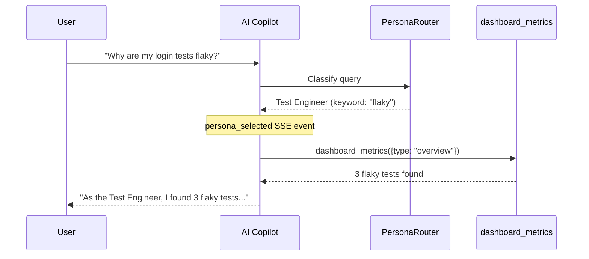
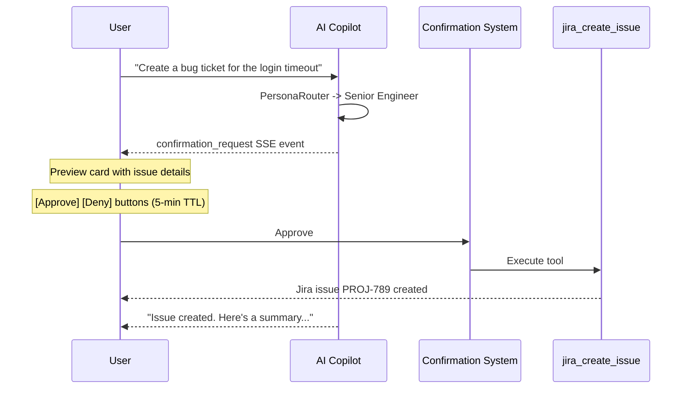
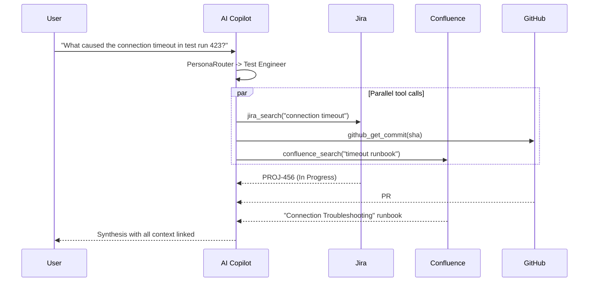
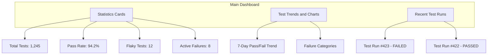
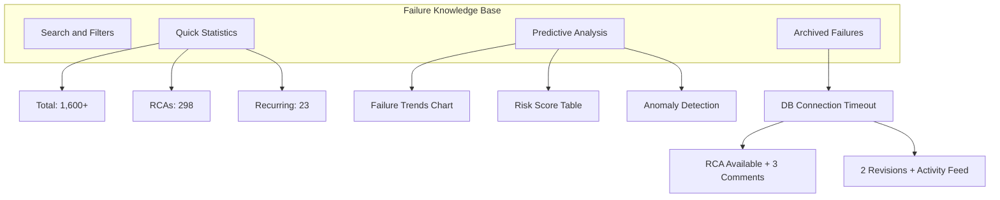

# TestOps Companion - Demo & Screenshots

> Visual guide to TestOps Companion's features and user interface.
> Updated for v2.9.0-rc.7 — Graduated Autonomy, Global AI Context, High-Fidelity Seeding.

---

## Quick Start Demo

```bash
npm install && npm run dev:simple
# Login: demo@testops.ai / demo123
```

Everything below works in demo mode with zero external dependencies.

---

## 3-Column Mission Control Layout

```
+------------------+-----------------------------+---------------------+
|                  |                             |                     |
|  Navigation      |  Main Content               |  AI Copilot Panel   |
|  Sidebar         |  (Dashboard, KB,            |  (Chat + Persona    |
|                  |   Pipeline, Teams)           |   Badge + Cards)   |
|  - Dashboard     |                             |                     |
|  - Pipelines     |  +--- Stats Cards ---+      |  [Test Engineer is  |
|  - Test Runs     |  | Runs | Pass% | Flaky |  |   handling this]    |
|  - Knowledge Base|  +-------------------+      |                     |
|  - Teams         |                             |  > Analyzing your   |
|  - Settings      |  +--- Trend Chart ---+      |    question...      |
|  - Cost Tracker  |  |                   |      |                     |
|                  |  +-------------------+      |  [tool: dashboard]  |
|                  |                             |  Found 3 flaky tests|
|                  |  +--- Recent Runs ---+      |                     |
|                  |  | Run #423 FAILED   |      |  Based on the data, |
|                  |  | Run #422 PASSED   |      |  here are the top   |
|                  |  +-------------------+      |  flaky tests...     |
+------------------+-----------------------------+---------------------+
```

---

## AI Copilot Workflows

### Workflow 1: Investigating a Flaky Test



**What the user sees:**
1. Persona badge: "Test Engineer is handling this"
2. Thinking indicator: "Analyzing your question..."
3. Tool call: "Calling dashboard_metrics..."
4. Rich result card with test data
5. Markdown answer with analysis and recommendations

### Workflow 2: Creating a Jira Issue (Human-in-the-Loop)



**What the user sees:**
1. Preview card showing the Jira issue that will be created
2. Approve/Deny buttons with a 5-minute countdown
3. After approval: result card with the created issue details
4. AI summarizes what was done and suggests next steps

### Workflow 3: Cross-Platform Context Enrichment



---

## Virtual Team Persona Routing

Every query is classified before the AI responds. The persona badge appears in the chat:

```
+-----------------------------------------------+
|  AI Copilot                      [Provider] [x] |
+-----------------------------------------------+
|                                                 |
|  You: "Why are my tests flaky?"                 |
|                                                 |
|  +----- [Test Engineer is handling this] -----+ |
|  |  Analyzing your question...                | |
|  |                                            | |
|  |  [Action: dashboard_metrics]               | |
|  |  Found 3 flaky tests in last 7 days       | |
|  |                                            | |
|  |  Based on the dashboard data, here are     | |
|  |  the top flaky tests:                      | |
|  |  1. test_login_timeout (68% pass rate)     | |
|  |  2. test_payment_flow (72% pass rate)      | |
|  |  3. test_api_health (85% pass rate)        | |
|  |                                            | |
|  |  **Recommendations:**                      | |
|  |  - Add retry logic for network calls       | |
|  |  - Increase timeout in test config         | |
|  +--------------------------------------------+ |
|                                                 |
|  [Type a message...]                    [Send]  |
+-------------------------------------------------+
```

**Routing examples:**

| You Ask | Persona Selected | Badge Shows |
|---------|-----------------|-------------|
| "Why are my tests flaky?" | TEST_ENGINEER | "Test Engineer is handling this" |
| "Pipeline build failed" | DEVOPS_ENGINEER | "DevOps Engineer is handling this" |
| "What can this tool do?" | AI_PRODUCT_MANAGER | "Product Manager is handling this" |
| "Check for auth vulnerabilities" | SECURITY_ENGINEER | "Security Engineer is handling this" |
| "Database migration failed" | DATA_ENGINEER | "Data Engineer is handling this" |
| "API is slow" | PERFORMANCE_ENGINEER | "Performance Engineer is handling this" |
| "Search Jira for AUTH-123" | SENIOR_ENGINEER | "Senior Engineer is handling this" |

---

## Confirmation Cards (Human-in-the-Loop)

Write operations show a preview card before executing:

```
+-----------------------------------------------+
|  Jira Create Issue                             |
|                                                |
|  Project: PROJ                                 |
|  Type: Bug                                     |
|  Summary: Login timeout in E2E test suite      |
|  Priority: High                                |
|  Assignee: Auto                                |
|                                                |
|  [Approve]  [Deny]        Expires in 4:32      |
+-----------------------------------------------+
```

**Write tools that require confirmation:**
- `jira_create_issue` -- Create Jira ticket
- `jira_transition_issue` -- Change issue status
- `jira_comment` -- Add comment to issue
- `github_create_pr` -- Open pull request
- `github_create_branch` -- Create branch
- `github_update_file` -- Modify file contents

---

## Dashboard Overview



---

## Failure Knowledge Base



---

## Key Feature Screenshots Checklist

### Essential:
- [ ] 3-column Mission Control layout (full view)
- [ ] AI Copilot chat with persona badge
- [ ] Persona routing in action (different queries, different badges)
- [ ] Confirmation card with Approve/Deny buttons
- [ ] Tool result card (e.g., dashboard_metrics)
- [ ] In-chat provider picker dropdown
- [ ] Failure Knowledge Base with trends chart
- [ ] Team Workspaces management page
- [ ] RCA modal with version history and comments

### Copilot Interactions:
- [ ] Flaky test investigation flow
- [ ] Jira issue creation with confirmation
- [ ] Cross-platform context enrichment results
- [ ] Pipeline status check
- [ ] "What can this do?" product discovery flow

---

## Video Demo Suggestions

### 1. Quick Start Demo (2 minutes)
- `npm run dev:simple` then browser opens
- Login then see dashboard with populated data
- Open AI copilot then ask about flaky tests
- See persona badge + tool calls + analysis

### 2. AI Copilot Deep Dive (3 minutes)
- Ask different queries, show different persona selections
- Demonstrate a write operation with confirmation flow
- Show cross-platform enrichment (Jira + Confluence + GitHub)
- Switch AI provider mid-session with the picker

### 3. Failure Investigation (3 minutes)
- Click into a failed test run
- View the RCA document with revision history
- Add a comment, see the activity feed
- Use predictive analysis (trends, risk scores)

### 4. Team Workspaces (2 minutes)
- Create a team, invite members
- Assign pipelines to the team
- Configure a shared dashboard

---

## Branding

| Element | Value |
|---------|-------|
| **Primary** | Blue `#1976d2` |
| **Success** | Green `#2e7d32` |
| **Error** | Red `#d32f2f` |
| **Warning** | Orange `#ed6c02` |
| **Font** | Roboto (headers bold, body regular) |
| **Icons** | Material-UI throughout |

---

*This file contains visual mockups. Actual screenshots will be added as the application evolves. Contributors welcome!*
