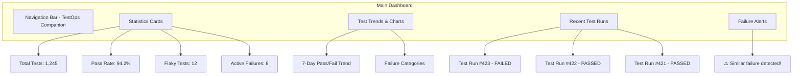
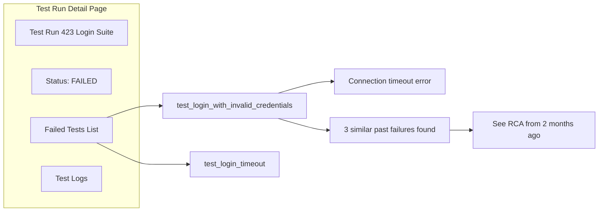
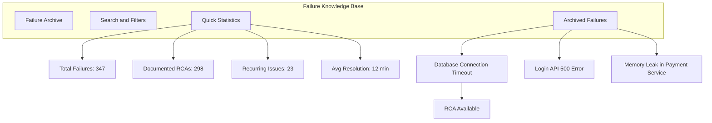
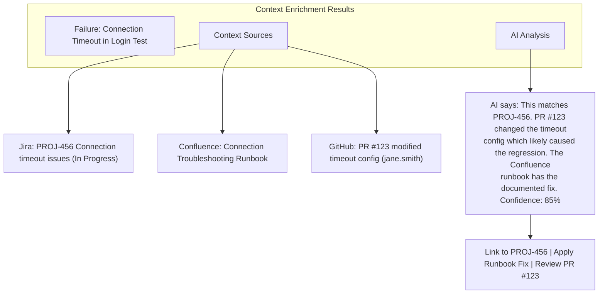
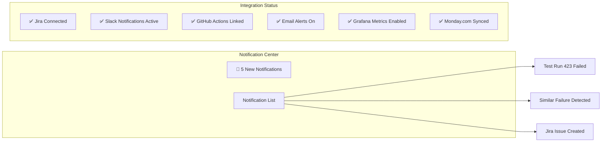
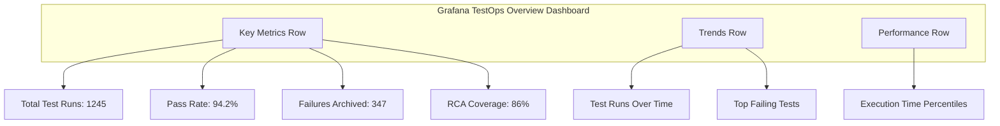
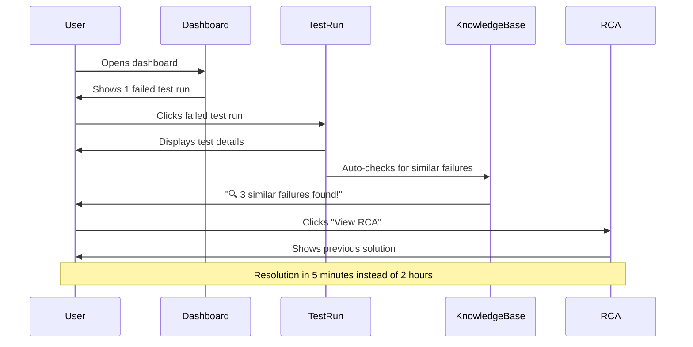
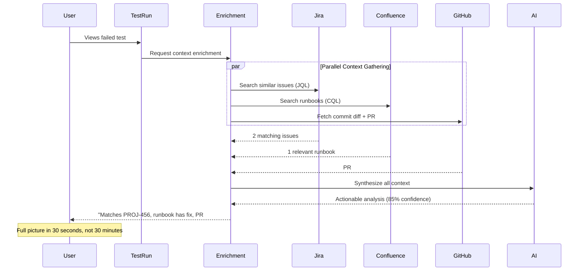
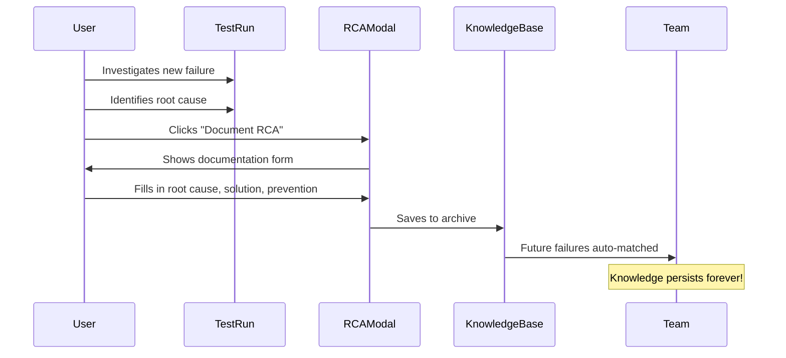
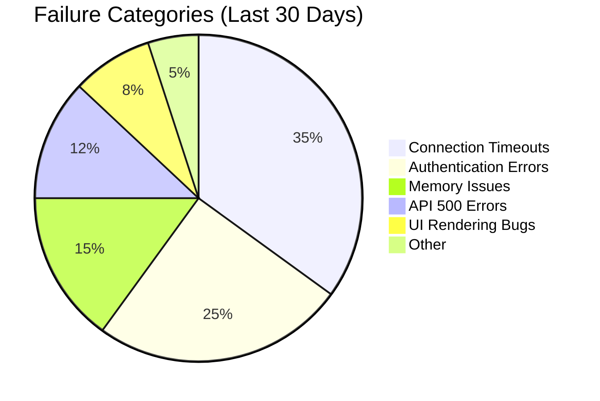

# TestOps Companion - Demo & Screenshots

> Visual guide to TestOps Companion's features and user interface

---

## 📸 Quick Preview

### Dashboard Overview



**Placeholder:** `screenshots/dashboard.png`

---

## 🎯 Key Features in Action

### 1. Test Run Details



**Placeholder:** `screenshots/test-run-detail.png`

---

### 2. Failure Knowledge Base Dashboard



**Placeholder:** `screenshots/knowledge-base.png`

---

### 3. RCA Documentation Modal

```mermaid
graph TD
    subgraph RCAModal["Document Root Cause Analysis"]
        Title[Failure: Database Connection Timeout]
        Form[RCA Documentation Form]
    end

    Form --> Field1[Root Cause*: Connection pool exhausted]
    Form --> Field2[Detailed Analysis: Under high load, max_connections=50 is insufficient]
    Form --> Field3[Solution: Increased max_connections to 200 in postgresql.conf]
    Form --> Field4[Prevention: Add monitoring alert at 80% pool usage]
    Form --> Field5[Workaround: Restart database service temporarily]
    Form --> Field6[Jira Ticket: INFRA-456]
    Form --> Field7[PR Link: github.com/org/repo/pull/123]
    Form --> Field8[Time to Resolve: 45 minutes]
    Form --> Field9[Tags: database, performance, connection-pool]

    Form --> Buttons[Save RCA | Cancel]
```

**Placeholder:** `screenshots/rca-modal.png`

---

### 4. Similar Failures Alert

```mermaid
graph LR
    subgraph Alert["🔍 Similar Past Failures Detected"]
        Message[We found 3 similar failures in the archive]
        TopMatch[Top Match: 95% similarity]
    end

    TopMatch --> Details[Failure from 2 months ago]

    Details --> RCAPreview[Root Cause Documented]

    RCAPreview --> Actions[View Full RCA | Mark as Same Issue]

    Alert --> ExpandMore[Show 2 more similar failures ▼]
```

**Placeholder:** `screenshots/similar-failures-alert.png`

---

### 5. Cross-Platform Context Enrichment (v2.8.0)



**Placeholder:** `screenshots/context-enrichment.png`

---

### 6. Pipeline Management

```mermaid
graph TD
    subgraph Pipelines["Pipeline Management"]
        Header[Active Pipelines]
        List[Pipeline List]
        Filters[Filters: All | GitHub Actions | Jenkins]
    end

    List --> P1[Main CI Pipeline - PASSING]
    List --> P2[E2E Test Suite - FAILING]
    List --> P3[Performance Tests - FLAKY]

    P2 --> Actions[View Results | Re-run | Configure]
```

**Placeholder:** `screenshots/pipeline-list.png`

---

### 7. Notifications & Integrations



**Placeholder:** `screenshots/notifications.png`

---

### 8. Grafana Metrics Dashboard



**Metrics Dashboard Panels:**
1. **Total Test Runs** - Stat panel showing cumulative count with trend
2. **Pass Rate Gauge** - Visual health indicator (green >90%, yellow 70-90%, red <70%)
3. **Failures Archived** - Knowledge base size with RCA documentation count
4. **RCA Coverage** - Percentage of failures with documented root causes
5. **Test Runs Over Time** - Time series comparing passed vs failed tests
6. **Top Failing Tests** - Pie chart of most common failures
7. **Execution Time Percentiles** - P50, P95, P99 performance tracking

**Prometheus Metrics Exposed:**
- `testops_test_runs_total` - Total number of test runs
- `testops_pass_rate_percent` - Current pass rate (0-100%)
- `testops_execution_time_p95_seconds` - 95th percentile execution time
- `testops_rca_coverage_percent` - RCA documentation coverage
- `testops_test_failures_count{test_name="..."}` - Per-test failure counts
- And 15+ more metrics for comprehensive monitoring

**Placeholder:** `screenshots/grafana-dashboard.png`

---

## 🎬 User Workflows

### Workflow 1: Investigating a Test Failure



**Placeholder:** `screenshots/workflow-investigation.png`

---

### Workflow 2: Cross-Platform Context Enrichment (v2.8.0)



**Placeholder:** `screenshots/workflow-enrichment.png`

---

### Workflow 3: Documenting a New Failure



**Placeholder:** `screenshots/workflow-documentation.png`

---

## 📊 Data Visualizations

### Test Trends Chart

```mermaid
graph TB
    subgraph TrendsChart["7-Day Test Execution Trends"]
        Title[Pass/Fail Rate Over Time]
        Legend[Green: Passed | Red: Failed | Yellow: Flaky]
    end

    Title --> Day1["Mon: 95% pass"]
    Title --> Day2["Tue: 94% pass"]
    Title --> Day3["Wed: 92% pass ⚠️"]
    Title --> Day4["Thu: 96% pass"]
    Title --> Day5["Fri: 97% pass"]
    Title --> Day6["Sat: 98% pass"]
    Title --> Day7["Sun: 95% pass"]

    Day3 --> Insight[Insight: Wednesday spike in failures]
```

**Placeholder:** `screenshots/test-trends.png`

---

### Failure Categories Breakdown



**Placeholder:** `screenshots/failure-breakdown.png`

---

## 🎨 UI Components

### Statistics Cards

```
┌─────────────────────────┐  ┌─────────────────────────┐
│   Total Test Runs       │  │    Overall Pass Rate    │
│       1,245             │  │        94.2%            │
│   ↑ 12% from last week  │  │    ↑ 2.1% this week     │
└─────────────────────────┘  └─────────────────────────┘

┌─────────────────────────┐  ┌─────────────────────────┐
│    Active Failures      │  │   Knowledge Base Docs   │
│          8              │  │         298             │
│   3 have similar past   │  │    ✅ 86% coverage       │
└─────────────────────────┘  └─────────────────────────┘
```

**Placeholder:** `screenshots/stats-cards.png`

---

### Alert Banners

```
╔══════════════════════════════════════════════════════════════════╗
║  🔍 SIMILAR FAILURE DETECTED                                     ║
║                                                                   ║
║  We found a match from 2 months ago with documented solution:    ║
║                                                                   ║
║  Root Cause: Database connection pool exhausted                  ║
║  Solution: Increase max_connections to 200 in postgresql.conf    ║
║  Time to Fix: 45 minutes (documented in INFRA-456)               ║
║                                                                   ║
║  [View Full RCA]  [Mark as Same]  [Dismiss]                      ║
╚══════════════════════════════════════════════════════════════════╝
```

**Placeholder:** `screenshots/alert-banner.png`

---

## 🎥 Video Demo Suggestions

When creating actual demo videos, cover these scenarios:

### 1. **Quick Start Demo (2 minutes)**
- Dashboard overview
- Click into a failed test
- View similar past failures
- See the documented RCA
- Resolution in seconds

### 2. **RCA Documentation Demo (3 minutes)**
- Investigate a new failure
- Document the root cause
- Add solution and prevention steps
- Link to Jira ticket
- Save to knowledge base

### 3. **Context Enrichment Demo (3 minutes)** *(v2.8.0)*
- Trigger a test failure with a known commit hash
- Watch the enrichment service query Jira, Confluence, and GitHub in parallel
- See the AI synthesis: matching Jira ticket + relevant runbook + PR that caused the issue
- One-click to link the failure to the existing Jira ticket
- Show the confidence score and how it changes with more context sources

### 4. **Integration Demo (2 minutes)**
- Configure Jira integration
- Configure Slack notifications
- Set up Grafana dashboard
- Test fails → Jira ticket auto-created
- Team receives Slack alert
- Similar failure alert shows up
- Metrics update in real-time on Grafana

### 5. **Knowledge Base Tour (3 minutes)**
- Browse archived failures
- Search for specific error patterns
- View statistics and insights
- See recurring failure patterns
- Export data

### 6. **Grafana Metrics Demo (2 minutes)**
- View real-time test metrics dashboard
- Explore pass rate trends over time
- Check execution time percentiles (P50, P95, P99)
- Review RCA coverage gauge
- See top failing tests breakdown
- Configure custom alerts for failure spikes

---

## 📸 Screenshot Checklist

When capturing actual screenshots, include:

### Essential Screenshots:
- [ ] Main dashboard (full view)
- [ ] Test run list page
- [ ] Test run detail page with failures
- [ ] Similar failures alert (expanded)
- [ ] RCA documentation modal
- [ ] Knowledge base dashboard
- [ ] Failure detail view with full RCA
- [ ] Pipeline management page
- [ ] Notification center
- [ ] Settings page with integrations
- [ ] Grafana metrics dashboard (full view)
- [ ] Grafana pass rate gauge
- [ ] Grafana execution time trends

### Feature Highlights:
- [ ] Smart matching in action (side-by-side comparison)
- [ ] Context enrichment results panel (Jira + Confluence + GitHub context)
- [ ] AI synthesis output with confidence score
- [ ] Jira integration working (ticket creation + similar issue search)
- [ ] Monday.com integration (item creation)
- [ ] Slack notification example
- [ ] Search and filter functionality
- [ ] Pattern detection results
- [ ] Grafana real-time metrics update
- [ ] Prometheus metrics endpoint response
- [ ] Mobile responsive views

### Before/After Comparisons:
- [ ] Investigation time: Without KB vs With KB
- [ ] Manual process vs Automated process
- [ ] Knowledge loss vs Knowledge retention

---

## 🎨 Branding & Style Guide

### Color Scheme:
- **Primary**: Blue (#1976d2) - Actions, links
- **Success**: Green (#2e7d32) - Passing tests
- **Error**: Red (#d32f2f) - Failed tests
- **Warning**: Orange (#ed6c02) - Flaky tests
- **Info**: Light Blue (#0288d1) - Information

### Typography:
- **Headers**: Roboto Bold
- **Body**: Roboto Regular
- **Code**: Fira Code / Monaco

### Icons:
- Material-UI icons throughout
- Custom icons for RCA knowledge base
- Integration logos (Jira, Slack, GitHub)

---

## 🚀 Creating Your Own Demo

### Quick Demo Setup:

1. **Start the app**:
   ```bash
   npm run start
   ```

2. **Seed demo data**:
   ```bash
   cd backend
   npm run db:seed
   ```

3. **Take screenshots**:
   - Use browser at 1920x1080 resolution
   - Clear, well-lit interface
   - Show real-world scenarios
   - Include diverse test cases

4. **Record screen**:
   - Use OBS Studio or QuickTime
   - 1080p resolution
   - Show cursor movements
   - Include voiceover explanation

5. **Create GIFs**:
   - Convert key interactions to GIFs
   - Max 10 seconds per GIF
   - Use tools like Gifski or ScreenToGif

---

## 📁 Screenshot Organization

```
screenshots/
├── dashboard/
│   ├── main-view.png
│   ├── stats-cards.png
│   └── test-trends.png
├── test-runs/
│   ├── list-view.png
│   ├── detail-view.png
│   └── logs-view.png
├── knowledge-base/
│   ├── dashboard.png
│   ├── failure-detail.png
│   ├── rca-modal.png
│   └── similar-failures-alert.png
├── integrations/
│   ├── jira-config.png
│   ├── slack-notification.png
│   ├── monday-config.png
│   ├── github-actions.png
│   └── grafana-datasource.png
├── grafana/
│   ├── dashboard-overview.png
│   ├── pass-rate-gauge.png
│   ├── test-trends-graph.png
│   ├── execution-time-percentiles.png
│   ├── top-failures-piechart.png
│   ├── rca-coverage-gauge.png
│   └── prometheus-metrics-endpoint.png
├── workflows/
│   ├── investigation-flow.gif
│   ├── documentation-flow.gif
│   ├── resolution-flow.gif
│   └── metrics-monitoring-flow.gif
└── mobile/
    ├── dashboard-mobile.png
    ├── notifications-mobile.png
    └── test-detail-mobile.png
```

---

## 💡 Tips for Great Screenshots

1. **Use realistic data**: Not "Test 1", "Test 2" - use real test names
2. **Show context**: Include navigation, breadcrumbs, timestamps
3. **Highlight features**: Use arrows or callouts for key elements
4. **Keep it clean**: Close unnecessary tabs, use consistent data
5. **Tell a story**: Screenshots should show a user journey
6. **Include state variations**: Empty states, loading states, error states

---

## 🎯 Interactive Demo Ideas

### Live Demo Site:
- Deploy to demo.testops-companion.com
- Pre-populated with realistic data
- Read-only access for public
- Auto-resets every 24 hours

### Guided Tour:
- Use tools like Intro.js or Shepherd.js
- Step-by-step walkthrough
- Highlight key features
- "Try it yourself" mode

### Video Tutorials:
- 1-minute feature highlights
- 5-minute getting started guide
- 10-minute deep dive
- Upload to YouTube/Vimeo

---

## 📞 Need Help?

For questions about creating demos or screenshots:
- See [Contributing Guide](CONTRIBUTING.md)
- Open an issue with the `documentation` label
- Check existing screenshots in the community

---

**Note**: This file contains visual mockups using Mermaid diagrams. Actual screenshots will be added as the application evolves. Contributors are welcome to submit screenshots following the guidelines above!
