# TestOps Companion — Visual UI Tour

> A guided walkthrough of the TestOps Companion interface.
> All screenshots captured in light theme at 1440x900 viewport.

---

## Login

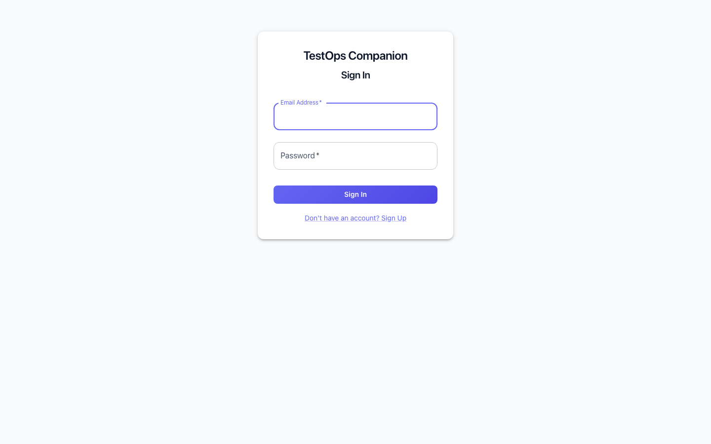

Clean sign-in screen with email/password authentication. Demo accounts use password `demo123`.

---

## Onboarding Wizard

First-time users see a 3-step setup wizard overlaid on the dashboard.

### Step 1: Welcome

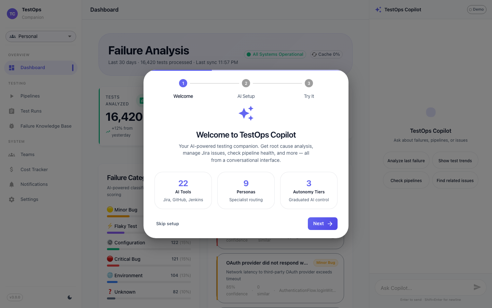

Introduction to TestOps Copilot with key stats: 22 AI tools, 9 specialist personas, and 3 autonomy tiers.

### Step 2: AI Provider Setup

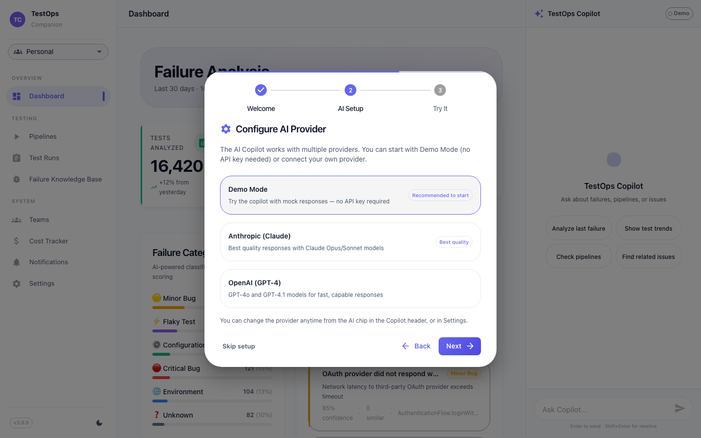

Choose your AI provider. Demo Mode works out of the box with no API key. Switch to Anthropic Claude or OpenAI anytime from the Copilot header.

### Step 3: Sample Queries

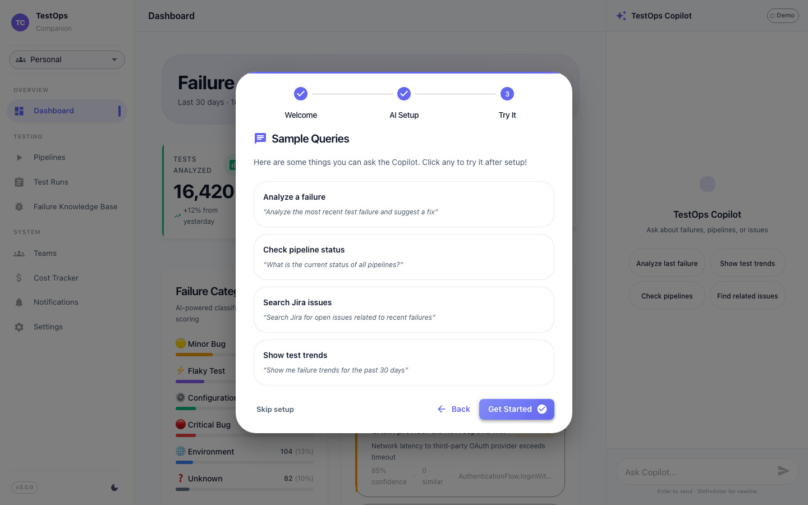

Ready-to-use prompts to get started: analyze a failure, check pipeline status, search Jira issues, or show test trends.

---

## Dashboard (3-Column Mission Control)

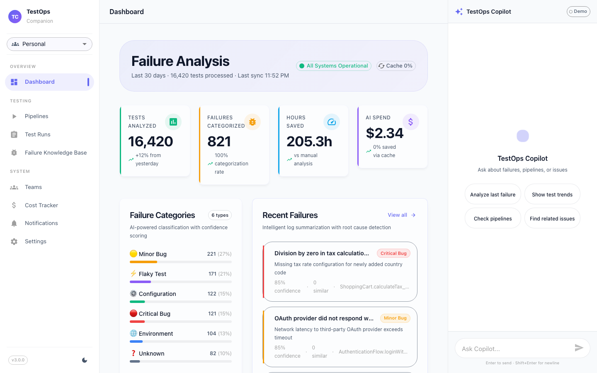

The main dashboard in its full 3-column layout:
- **Left sidebar** — Navigation with team selector and version badge
- **Center** — Failure analysis metrics, category breakdown, and recent failures with AI-powered root cause detection
- **Right** — AI Copilot panel with quick-action buttons

---

## AI Copilot Interactions

The Copilot panel supports natural language queries that trigger specialized tools and render rich result cards.

### Dashboard Metrics

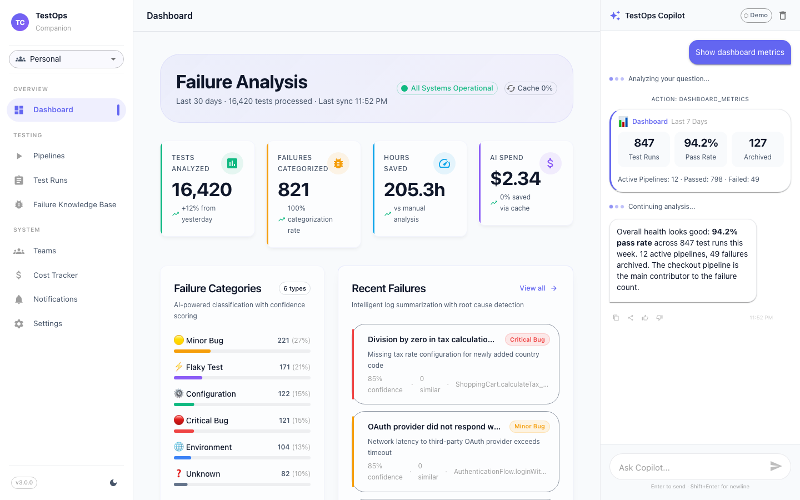

Ask "Show dashboard metrics" to get a MetricsCard with test run counts, pass rates, and pipeline health at a glance.

### Jira Search Results

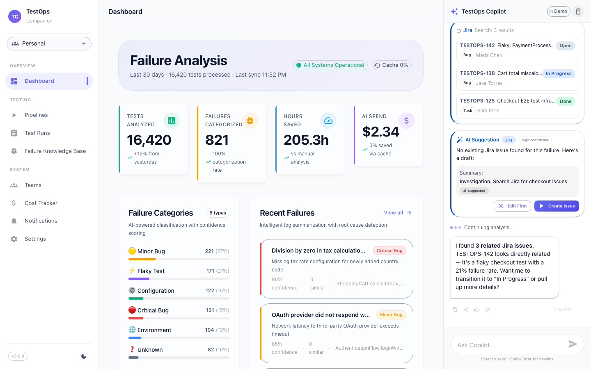

Ask "Search Jira for checkout issues" to get a JiraSearchCard with matching issues, status chips, and priority indicators.

### Failure Predictions

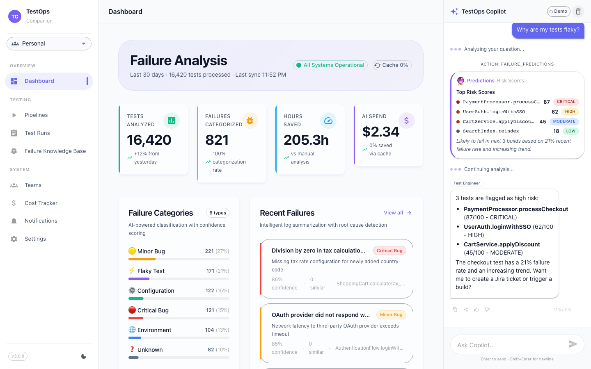

Ask "Why are my tests flaky?" to get a PredictionCard with risk-scored tests and failure trend analysis.

### GIF Personality Layer

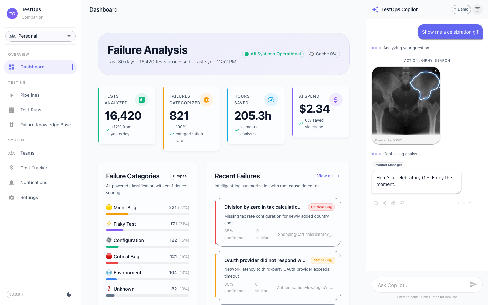

Ask "Show me a celebration gif" to get an inline GIF from Giphy — the Copilot's personality layer for lighter moments.

---

## Core Pages

### Pipelines

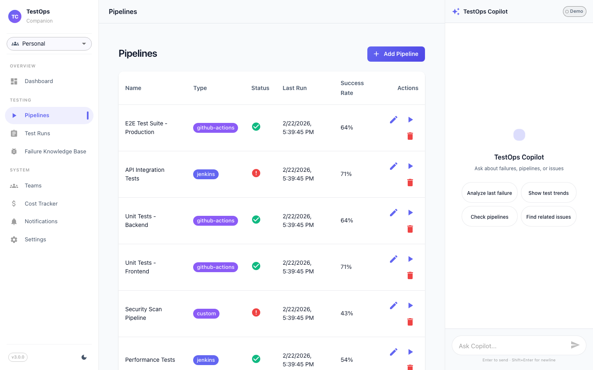

All CI/CD pipelines with type badges (GitHub Actions, Jenkins, custom), status indicators, success rates, and action controls.

### Test Runs

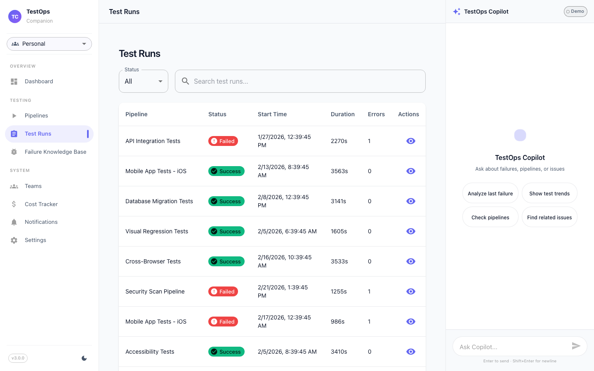

Paginated test run history with status filters, search, duration tracking, and error counts. Click any row for detailed logs and screenshots.

### Failure Knowledge Base

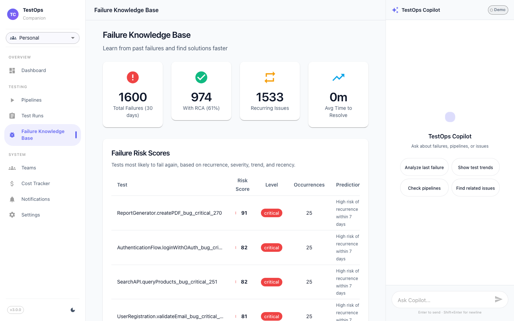

Learn from past failures. Stat cards show total failures, RCA coverage, and recurring issues. The risk score table ranks tests most likely to fail again.

### Cost Tracker

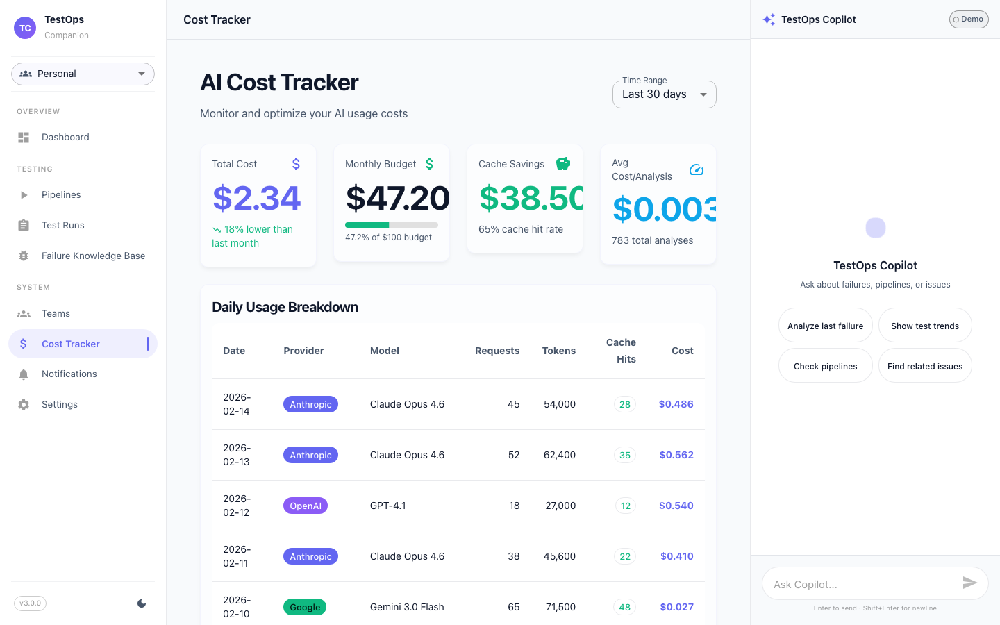

Monitor AI usage costs with daily breakdowns by provider and model. Track total spend, cache savings, and average cost per analysis.
