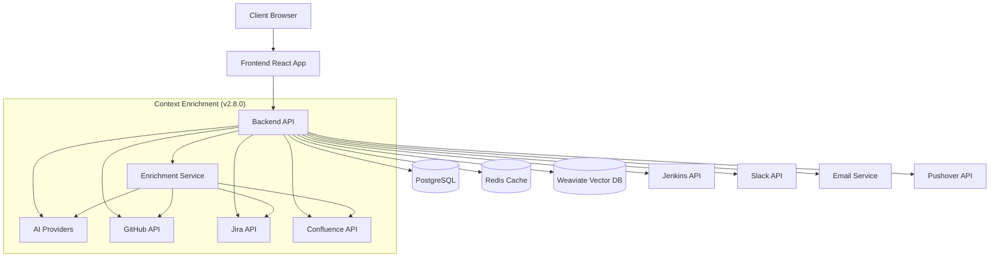
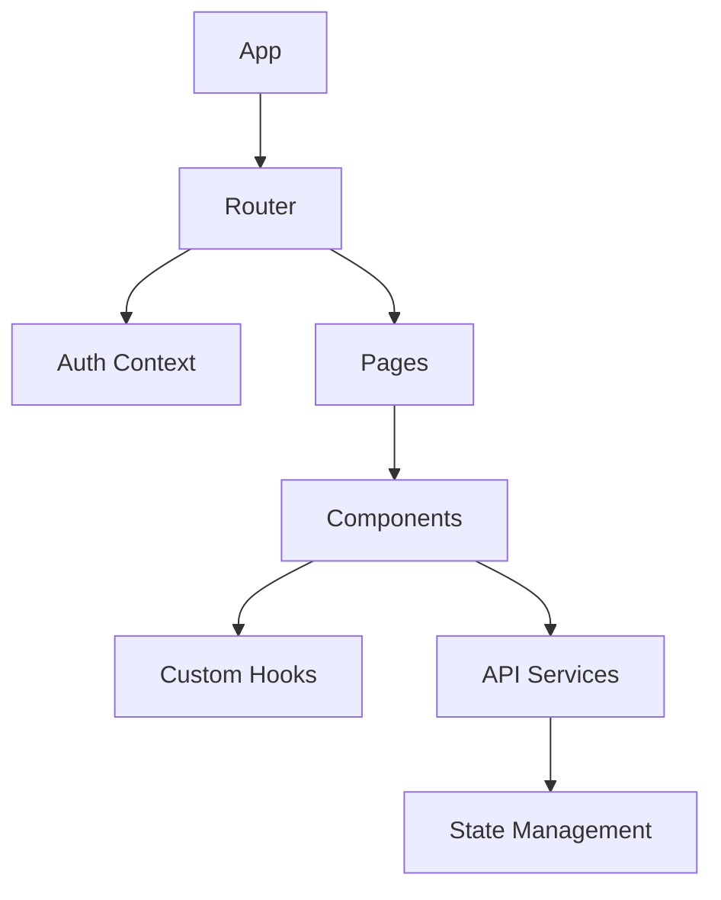
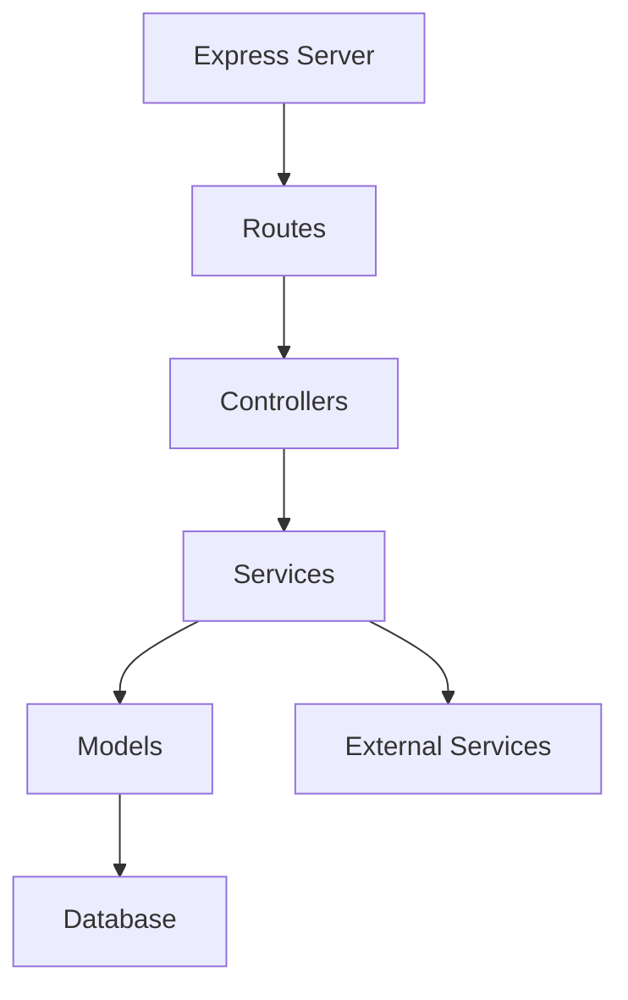
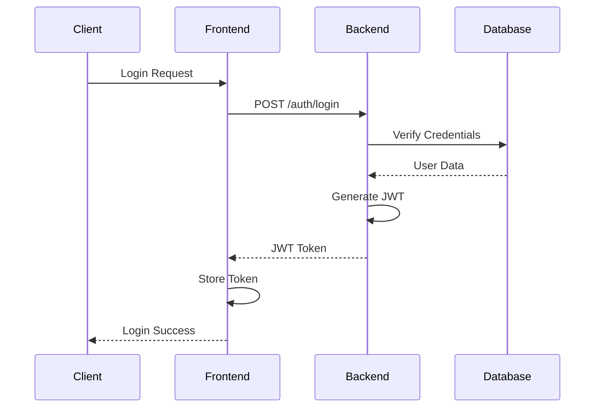
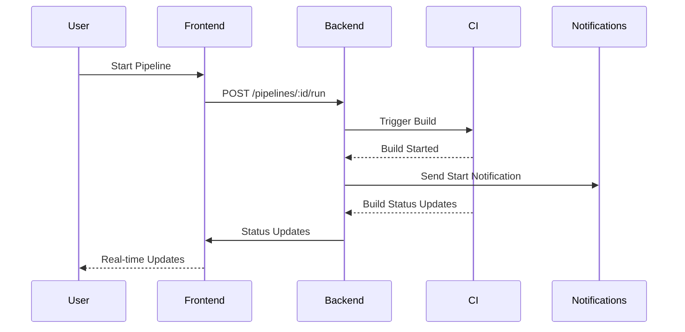
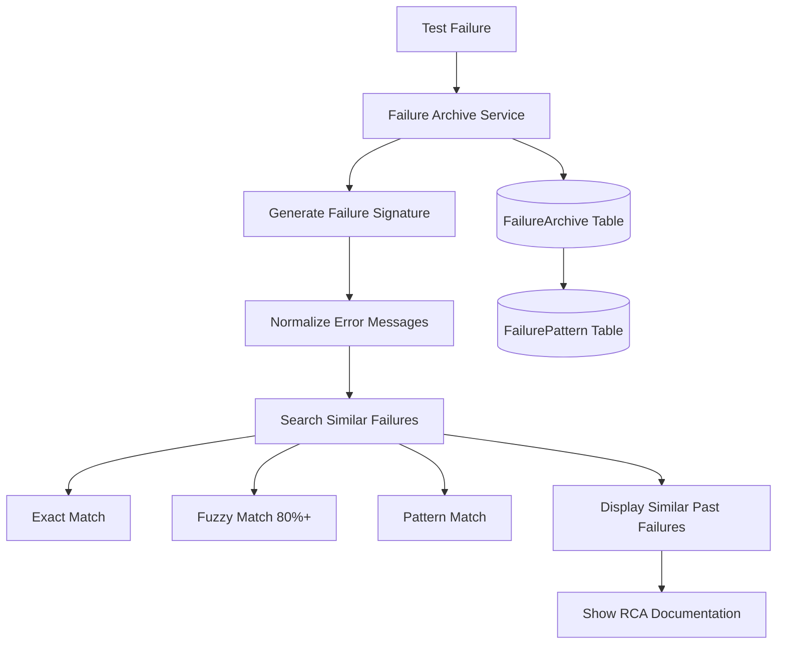
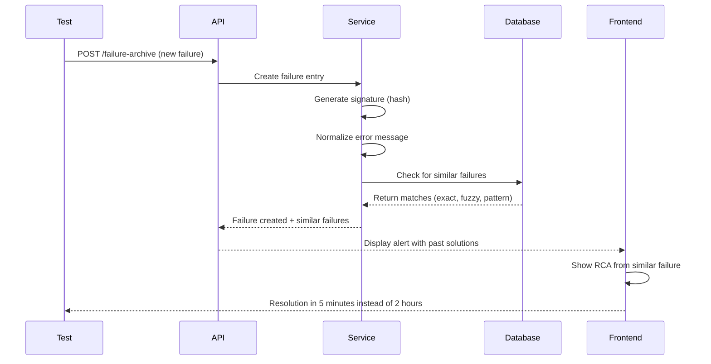
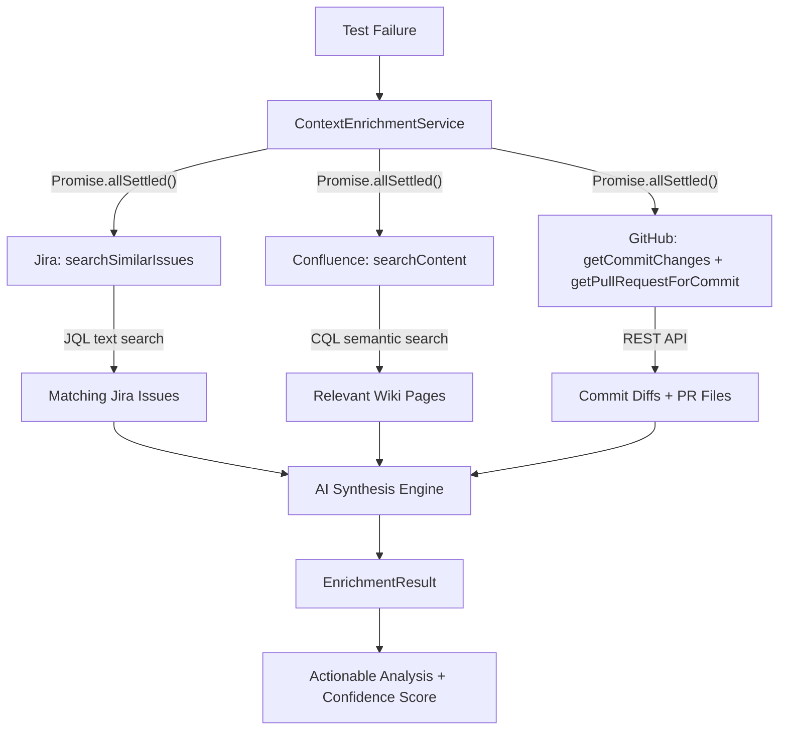
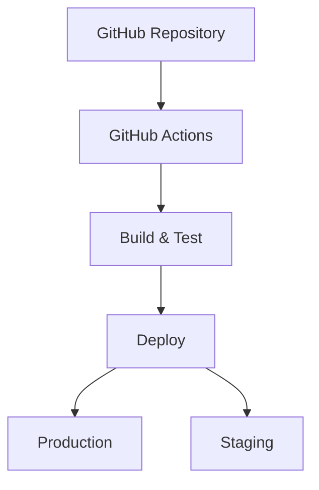

# TestOps Copilot Architecture

> **Canonical spec**: [`specs/ARCHITECTURE.md`](../specs/ARCHITECTURE.md) (v3.0.0) | **Autonomy model**: [`specs/AUTONOMOUS_AI_SPEC.md`](../specs/AUTONOMOUS_AI_SPEC.md)
>
> This page provides visual architecture diagrams. For authoritative system design details, see the canonical spec above.

## System Overview

## Core Components

### Frontend Architecture

- **React Application**: Built with TypeScript and Vite
- **Material UI / Tailwind**: For consistent UI components
- **React Query**: For efficient data fetching and caching
- **Zustand**: For lightweight state management
- **React Router**: For client-side routing
- **React Testing Library**: For component testing
- **Cypress**: For end-to-end testing

### Backend Architecture

- **Express.js**: Main web framework
- **TypeScript**: For type safety and better developer experience
- **Prisma**: ORM for database interactions with type-safe queries
- **PostgreSQL**: Primary database
- **Redis**: For caching and rate limiting (optional)
- **Jest**: For unit and integration testing

## Data Flow

### Authentication Flow

### Pipeline Execution Flow

## Security Architecture

- JWT-based authentication
- Role-based access control (RBAC)
- Rate limiting
- Input validation
- XSS protection
- CSRF protection
- Secure headers
- Data encryption

## Caching Strategy

- Redis for server-side caching
- React Query for client-side caching
- Cache invalidation on data mutations
- Configurable cache timeouts

## Failure Knowledge Base Architecture

The Failure Knowledge Base is a critical component for institutional knowledge retention and intelligent failure matching.

### Failure Matching Flow

### Smart Matching Algorithm

1. **Signature Generation**:
   - Hash of test name + normalized error + stack trace
   - Removes timestamps, UUIDs, IDs, line numbers
   - Creates consistent fingerprint for matching

2. **Three-Strategy Search**:
   - **Exact Match**: Identical signature (100% match)
   - **Fuzzy Match**: Levenshtein distance ≥80% similarity
   - **Pattern Match**: Known recurring patterns

3. **Knowledge Retention**:
   - Root cause analysis documentation
   - Solutions and workarounds
   - Related Jira tickets and PRs
   - Time to resolve tracking
   - Tag-based organization

## Cross-Platform Context Enrichment (v2.8.0)

The context enrichment system gathers information from multiple platforms in parallel to produce richer failure analysis.

### Key Design Decisions

- **Parallel execution**: All three sources are queried concurrently using `Promise.allSettled()` so one source failing doesn't block the others
- **Graceful degradation**: Works with or without AI, with or without any specific integration. Falls back to a basic text summary if the AI provider is unavailable
- **Smart input cleaning**: Jira queries strip timestamps, UUIDs, memory addresses, and file paths from error messages before searching
- **Diff truncation**: GitHub diffs are capped at 2,000 characters to prevent prompt token overflow
- **Relevance scoring**: Files from PRs are scored against the stack trace and error message; only the top 5 most relevant files are included in the AI prompt
- **Confidence estimation**: Score ranges from 0.3 (base) up to 0.95, increasing when Jira issues (+ 0.2), Confluence pages (+0.15), or PRs (+0.25) are found

## External Integrations

### CI/CD Systems
- Jenkins API integration
- GitHub Actions integration
- Custom CI system support

### Notification Systems
- Slack integration
- Email notifications
- Pushover notifications

### Issue Tracking & Project Management
- **Jira**: Automatic issue creation, bi-directional sync, custom field mapping, and similar issue search *(v2.8.0)*
- **Monday.com**: Work OS integration, automatic item creation from failures, GraphQL API
- Link failures to existing issues
- Search and prevent duplicate entries

### Monitoring & Observability
- **Prometheus**: Metrics endpoint at `/metrics` in standard Prometheus format
- **Grafana**: Pre-built dashboards for test metrics visualization
- Real-time metrics export
- Custom alerting rules
- Performance tracking and analysis

## Monitoring and Logging

- Structured logging with Winston
- Error tracking with Sentry
- Performance monitoring
- Custom metrics collection
- Audit logging

## Deployment Architecture

- Docker containerization
- Docker Compose for development
- Kubernetes for production (optional)
- CI/CD automation
- Blue-green deployments

## Performance Considerations

- Database indexing strategy
- Caching layers
- API rate limiting
- Lazy loading
- Code splitting
- Asset optimization

## Scalability

- Horizontal scaling capability
- Load balancing
- Database replication
- Caching strategy
- Message queues (future)

## Database Schema Highlights

### Core Tables
- **User**: Authentication and user management
- **Pipeline**: CI/CD pipeline configurations
- **TestRun**: Test execution records
- **TestResult**: Individual test results
- **Notification**: Notification history and settings

### Failure Knowledge Base Tables
- **FailureArchive**: Complete failure records with RCA
  - Indexed on: `failureSignature`, `testName`, `occurredAt`, `status`, `isRecurring`
  - Stores: error messages, stack traces, RCA documentation, solutions

- **FailurePattern**: Detected recurring patterns
  - Indexed on: `signature`
  - Stores: pattern descriptions, affected tests, confidence scores

### Relationships
- User → Pipeline (one-to-many)
- Pipeline → TestRun (one-to-many)
- TestRun → TestResult (one-to-many)
- TestRun → FailureArchive (one-to-many)
- FailureArchive → FailurePattern (many-to-one via signature matching)

## Future Architecture Considerations

1. **Enhanced AI/ML Integration**
   - ~~Automated RCA suggestions using LLMs~~ *(Shipped: v2.5.3)*
   - ~~Cross-platform context enrichment~~ *(Shipped: v2.8.0)*
   - Improved pattern detection with machine learning
   - Predictive test failure analysis
   - Anomaly detection improvements

2. **Real-time Features**
   - WebSocket integration for live updates (already implemented)
   - Event-driven architecture expansion
   - Real-time collaborative RCA documentation

3. **Microservices Evolution**
   - Split into smaller, focused services
   - Service mesh implementation
   - API gateway introduction

4. **Mobile Support**
   - React Native application
   - Progressive Web App
   - Mobile-specific API endpoints

5. **Plugin System**
   - Plugin architecture
   - Custom integration framework
   - Marketplace support