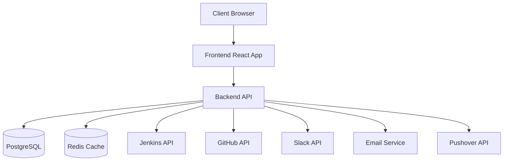
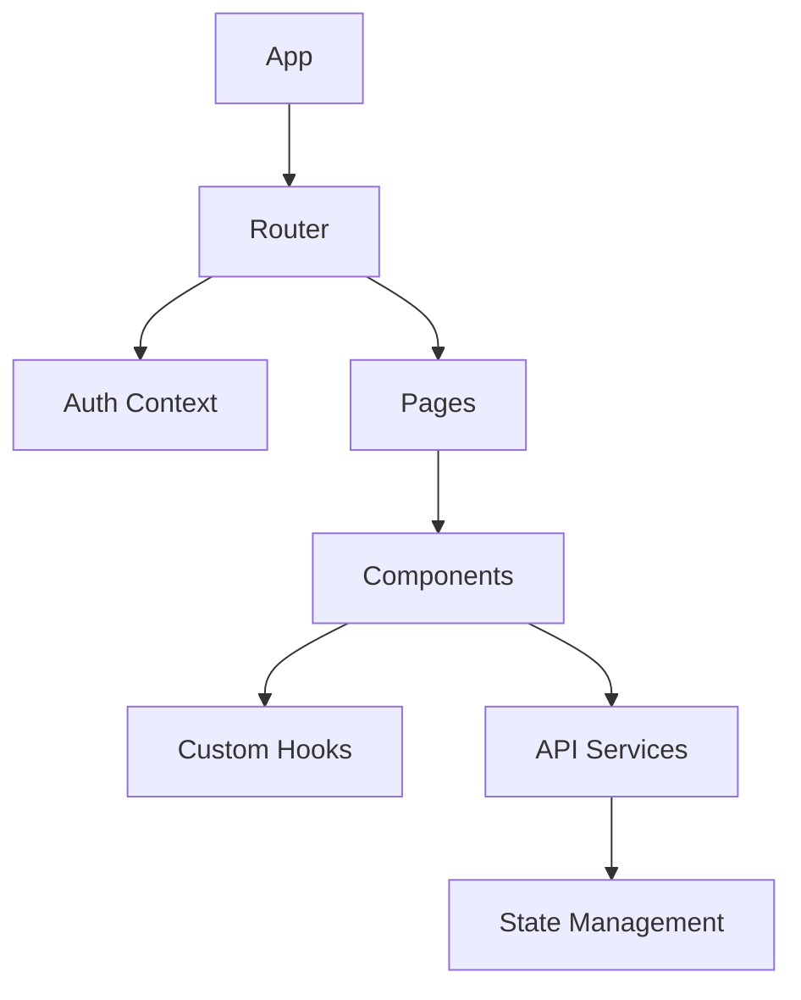
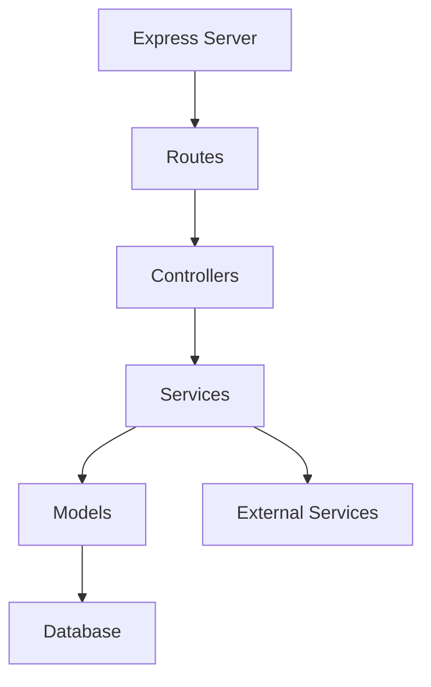
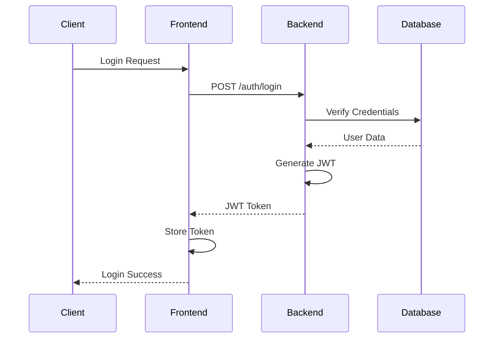
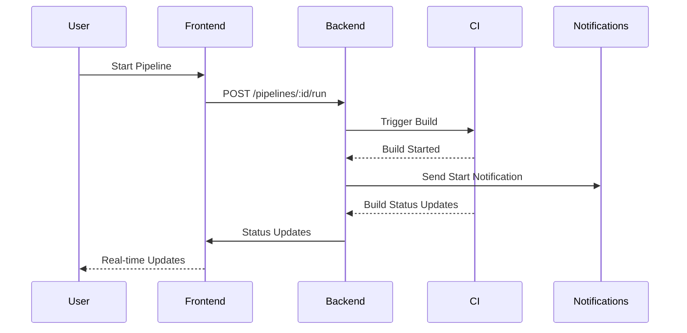
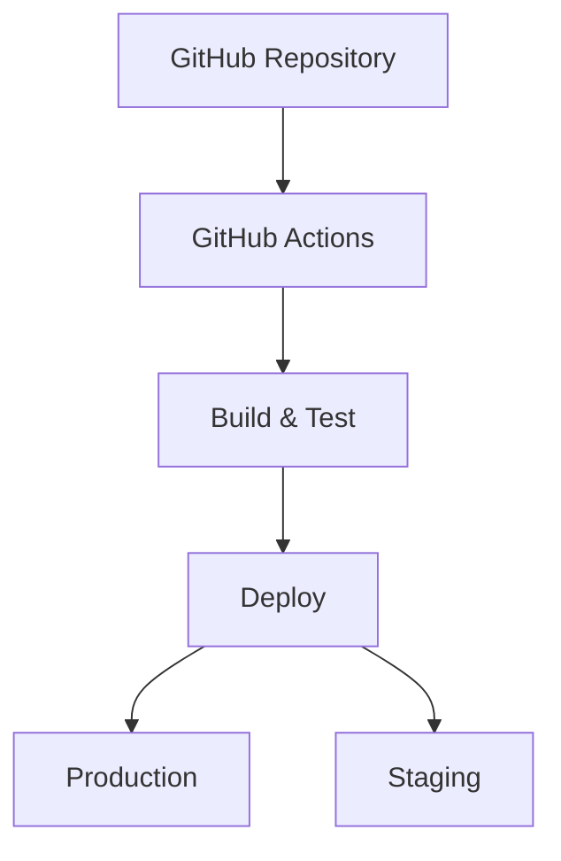

# TestOps Companion Architecture

## System Overview

TestOps Companion is built using a modern microservices architecture, with clear separation between frontend and backend components. The system is designed to be scalable, maintainable, and easily extensible.

## Core Components

### Frontend Architecture

- **React Application**: Built with TypeScript and Vite
- **Material UI / Tailwind**: For consistent UI components
- **React Query**: For efficient data fetching and caching
- **Zustand**: For lightweight state management
- **React Router**: For client-side routing
- **React Testing Library**: For component testing
- **Cypress**: For end-to-end testing

### Backend Architecture

- **Express.js**: Main web framework
- **TypeScript**: For type safety and better developer experience
- **Sequelize**: ORM for database interactions
- **PostgreSQL**: Primary database
- **Redis**: For caching and rate limiting
- **Jest**: For unit and integration testing

## Data Flow

### Authentication Flow

### Pipeline Execution Flow

## Security Architecture

- JWT-based authentication
- Role-based access control (RBAC)
- Rate limiting
- Input validation
- XSS protection
- CSRF protection
- Secure headers
- Data encryption

## Caching Strategy

- Redis for server-side caching
- React Query for client-side caching
- Cache invalidation on data mutations
- Configurable cache timeouts

## External Integrations

### CI/CD Systems
- Jenkins API integration
- GitHub Actions integration
- Custom CI system support

### Notification Systems
- Slack integration
- Email notifications
- Pushover notifications

### Test Management
- TestRail integration
- Xray integration
- Custom test result parsers

## Monitoring and Logging

- Structured logging with Winston
- Error tracking with Sentry
- Performance monitoring
- Custom metrics collection
- Audit logging

## Deployment Architecture

- Docker containerization
- Docker Compose for development
- Kubernetes for production (optional)
- CI/CD automation
- Blue-green deployments

## Performance Considerations

- Database indexing strategy
- Caching layers
- API rate limiting
- Lazy loading
- Code splitting
- Asset optimization

## Scalability

- Horizontal scaling capability
- Load balancing
- Database replication
- Caching strategy
- Message queues (future)

## Future Architecture Considerations

1. **Microservices Evolution**
   - Split into smaller, focused services
   - Service mesh implementation
   - API gateway introduction

2. **Real-time Features**
   - WebSocket integration
   - Event-driven architecture
   - Real-time analytics

3. **Machine Learning Integration**
   - Test failure prediction
   - Anomaly detection
   - Performance forecasting

4. **Mobile Support**
   - React Native application
   - Progressive Web App
   - Mobile-specific API endpoints

5. **Plugin System**
   - Plugin architecture
   - Custom integration framework
   - Marketplace support