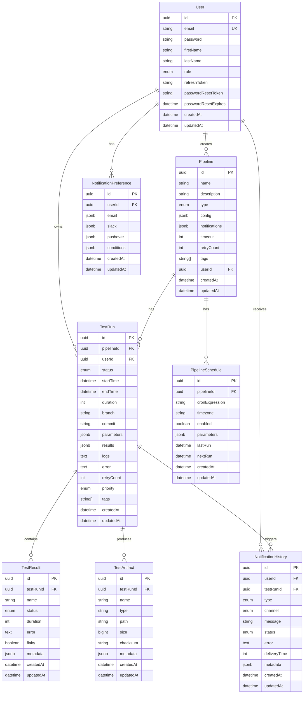

# Database Schema Documentation

> Updated for v3.4.0 | **Canonical schema**: [`backend/prisma/schema.prisma`](../backend/prisma/schema.prisma) (24 models) | **Architecture**: [`specs/ARCHITECTURE.md`](../specs/ARCHITECTURE.md) §4

## Overview

TestOps Copilot uses PostgreSQL as its primary database. The schema is managed using Prisma ORM with TypeScript.

## Entity Relationship Diagram



## Table Descriptions

### Users
Stores user account information and authentication details.
- Primary key: `id` (UUID)
- Unique constraints: `email`
- Indexes: `email`, `role`

### Pipelines
Stores pipeline configurations and metadata.
- Primary key: `id` (UUID)
- Foreign keys: `userId` references Users(id)
- Indexes: `userId`, `type`, `tags`

### TestRuns
Records individual test execution instances.
- Primary key: `id` (UUID)
- Foreign keys: 
  - `pipelineId` references Pipelines(id)
  - `userId` references Users(id)
- Indexes: `pipelineId`, `userId`, `status`, `createdAt`

### TestResults
Stores detailed test case results.
- Primary key: `id` (UUID)
- Foreign keys: `testRunId` references TestRuns(id)
- Indexes: `testRunId`, `status`, `flaky`

### TestArtifacts
Manages test-related files and artifacts.
- Primary key: `id` (UUID)
- Foreign keys: `testRunId` references TestRuns(id)
- Indexes: `testRunId`, `type`

### PipelineSchedules
Manages scheduled pipeline executions.
- Primary key: `id` (UUID)
- Foreign keys: `pipelineId` references Pipelines(id)
- Indexes: `pipelineId`, `enabled`, `nextRun`

### NotificationPreferences
Stores user notification settings.
- Primary key: `id` (UUID)
- Foreign keys: `userId` references Users(id)
- Indexes: `userId`

### NotificationHistory
Records notification delivery attempts and status.
- Primary key: `id` (UUID)
- Foreign keys: 
  - `userId` references Users(id)
  - `testRunId` references TestRuns(id)
- Indexes: `userId`, `testRunId`, `type`, `status`, `createdAt`

## JSON Schemas

### Pipeline Config
```json
{
  "url": "string",
  "credentials": {
    "username": "string",
    "apiToken": "string"
  },
  "repository": "string?",
  "branch": "string?",
  "triggers": ["push" | "pull_request" | "schedule" | "manual"]?,
  "schedule": "string?"
}
```

### Notification Config
```json
{
  "enabled": "boolean",
  "channels": ["slack" | "email" | "pushover"],
  "conditions": ["success" | "failure" | "started" | "completed"]
}
```

### Test Results
```json
{
  "total": "number",
  "passed": "number",
  "failed": "number",
  "skipped": "number",
  "flaky": "number",
  "coverage": "number?",
  "reportUrl": "string?"
}
```

## Enums

### UserRole
- `admin`
- `user`

### PipelineType
- `jenkins`
- `github-actions`
- `custom`

### TestStatus
- `pending`
- `running`
- `success`
- `failure`
- `cancelled`
- `timeout`

### NotificationType
- `pipeline`
- `test`
- `system`
- `broadcast`
- `test-flaky`
- `coverage`

### NotificationChannel
- `email`
- `slack`
- `pushover`

### NotificationStatus
- `pending`
- `sent`
- `failed`
- `delivered`

## Migrations

Migrations are managed using Prisma Migrate:

```bash
# Create a new migration
npx prisma migrate dev --name add_user_role

# Apply pending migrations
npx prisma migrate deploy

# Reset database
npx prisma migrate reset
```

## Indexes

Important indexes for performance:

1. Users
   - `email` (unique)
   - `role`

2. Pipelines
   - `userId`
   - `type`
   - `tags` (GIN)

3. TestRuns
   - `pipelineId`
   - `userId`
   - `status`
   - `createdAt`
   - `tags` (GIN)

4. NotificationHistory
   - `userId`
   - `testRunId`
   - `type`
   - `status`
   - `createdAt`

## Backup and Recovery

1. Regular backups:
```bash
pg_dump -U postgres testops > backup.sql
```

2. Point-in-time recovery:
```bash
psql -U postgres testops < backup.sql
```

## Performance Considerations

1. Use appropriate indexes
2. Implement pagination
3. Use efficient queries
4. Regular maintenance
5. Monitor performance

## Data Retention

- Test runs: 90 days
- Test artifacts: 30 days
- Notification history: 30 days
- Logs: 14 days